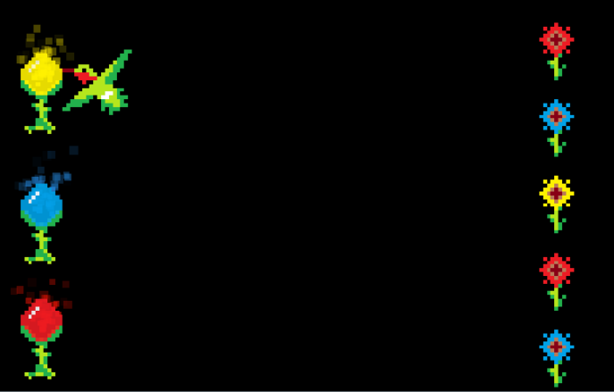

#  Pollumination

## Lights, colors, and hummingbirds

### Eternal Work In Progress

Pollumination was intended to be a game where hummingbirds collected light particles to pollinate flowers.

In their current state, Pullomination was just a practice of pixel art drawing and animations, and particle emitters in Construct2.
